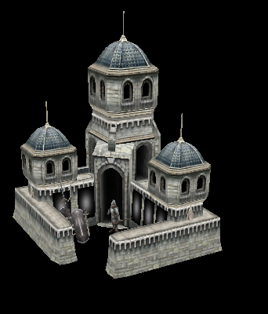

# Purpose of this project
This project is aimed at loading w3d model files (Westwood 3D), a format that was used for games of the Westwood Studio and 
EAs SAGE Engine.

# Build status
[](https://travis-ci.org/feliwir/libw3d)
[](https://ci.appveyor.com/project/feliwir/libw3d)

# How to build
Make sure you clone the repository recursive, since it makes use of a lot of submodules

```sh
$ mkdir build && cd build
$ cmake ..
$ cmake --build .
```

# Format specification
Most of information is taken from w3dmodel header, that was part of the RenX SDK.

# Current status
Loading of most chunks is added, but the w3d_viewer is currently not rendering everything.
Parts missing is:
- skeletons
- animations (compressed & uncompressed)
- vertex colors
- texture animation

Sample screenshot of Barracks from Battle for Middleearth II
